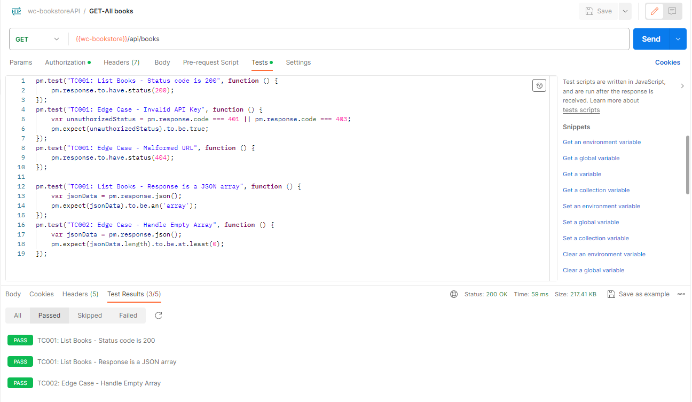

- [API Test Lab](#api-test-lab)
  - [Lab Testing](#lab-testing)

## API Test Lab

### Lab Testing

- **TC001: Testing endpoint: Endpoint: `/api/books`**
  - Result:Request was sent with valid credentials and The response was Valid with  status code 200 OK
  - Status: Complete & Passed
  
 
  - Send a request with invalid or no API key using this endpoint
    - Result:401 was returned when an invalid API key was supplied
    - Status:Complete & Passed
     

  - Send a request with invalid or no API key using this endpoint
    - Result:404 Not Found or similar error response was reeturned
    - Status:Complete & Passed
    
  
  

- **TC002: Testing Endpoint supplied with attribute: `/api/books?attribute=published_year&value=2007`**
  - Result:Request was sent with valid credentials and The response was Valid
  - Status:Complete & Passed

  - Use non-existent attribute values (e.g., a future year) and expect a proper handling 
    - Result:4empty Array was returned
    - Status:Complete & Passed
  
  - Verify the API's response when the attribute filter matches no books
    - Result:empty Array was returned
    - Status:Complete & Passed


- **TC003:Test Endpoint to Display single Book for   `/api/books/{isbn}`**
  - Tester Code Used:
```
pm.test("TC003: Display Single Book - Status code is 200", function () {
    pm.response.to.have.status(200);
});
pm.test("TC003: Invalid ISBN", function () {
    pm.response.to.have.status(404);
});
pm.test("TC003: Display Single Book - Response is a JSON object", function () {
    var jsonData = pm.response.json();
    pm.expect(jsonData).to.be.an('object');
});

```
  - send a GET request for a single book 
    - Result: a valid json response is returned with a status code 200 ok
  - Status:Complete & Passed


- Use an invalid or non-existent ISBN and expect a 404 Error
  - Result:404 error returned
  - Status:Complete & Passed

  
- **TC004:: Testing Endpoint : Add Book to Cart   `/api/{{userID}}/cart/add`** 
  
  - Tester Code Used:

```
pm.test("TC004: Add Book to Cart - Status code is 201", function () {
    pm.response.to.have.status(201);
});
pm.test("TC004: Add Non-existent Book", function () {
    pm.response.to.have.status(404);
});

pm.test("TC008: Add Book to Cart - Contains ISBN ,authors,categories,num_pages,published_year,subtitle,title", function () {
    var jsonData = pm.response.json();
    pm.expect(jsonData).to.have.property('ISBN');
    pm.expect(jsonData).to.have.property('authors');
    pm.expect(jsonData).to.have.property('categories')
    pm.expect(jsonData).to.have.property('num_pages')
    pm.expect(jsonData).to.have.property('published_year')
    pm.expect(jsonData).to.have.property('subtitle')
    pm.expect(jsonData).to.have.property('title')
});

```

- check for a 201 Created status after adding a book
  - Result:valid JSON response with 201 status code
  - Status:Complete & Passed
 

- Confirm the presence of ISBN ,authors,categories,num_pages,published_year,subtitle,title in the response by supplying a missing key value pair in the JSON payload
  - Result:response with 404 status code returned as expected
  - Status:Complete & Passed


