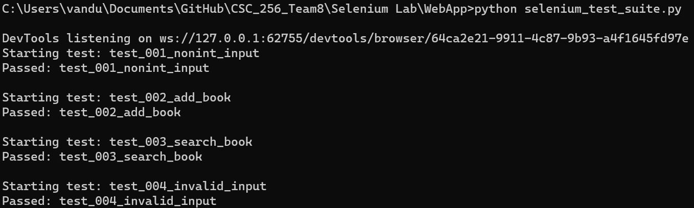

# Lab Testing Progress

## API Test Lab
### Lab Testing
- **TC001:** TBD
	- Result:
	- Status:
- **TC002:** TBD
	- Result:
	- Status:
- **TC003:** TBD
	- Result:
	- Status:
- **TC004:** TBD (Student Input)
	- Result:
	- Tester Code Used:
	- Status:

- - -

## BDD Lab
### Lab Testing
- **TC001: Validate that only partial input for a new book shows an error**
	- Result: After partial input of a book, it will display an error instead of submitting the new book.
	- Status:
- **TC002: Sorting by the page column shows the smallest page count book**
	- Result: The smallest page book will be the top row of the list.
	- Status
- **TC003: Ensure the search bar only filters by titles (Student Input)**
	- Result: After searching for a value not in a title, there will be no results in the books list.
	- Tester Code Used:
	- Status:
- **TC004: Add a new book (Student Input)**
	- Result: The newly added book will be present in the list.
	- Tester Code Used:
 	- Status:

- - -

## Playwright Lab
### Lab Testing
- **TC001: Loading the Webpage and Checking the Title**
	- Result: For the "Loading the Webpage" test, the page title should match "County Bookstore".
	- Status: Attempted - currently waiting for [Issue #21](https://github.com/rsteve-dev/CSC_256_Team8/issues/21) to be resolved.
- **TC002: Adding a New Book**
	- Result: In the "Adding a New Book" test, the new book title should be present in the page content after submission.
	- Status: Attempted - currently waiting for [Issue #21](https://github.com/rsteve-dev/CSC_256_Team8/issues/21) to be resolved.
- **TC003: Search Functionality (Student Input)**
	- Result: Expected results will depend on the specific implementation but should generally include successful execution of the search.
	- Tester Code Used:
	- Status: Attempted - currently waiting for [Issue #21](https://github.com/rsteve-dev/CSC_256_Team8/issues/21) to be resolved.
- **TC004: Error Handling (Student Input)**
	- Result: Expected results will depend on the specific implementation but should generally include proper error handling.
	- Tester Code Used:
	- Status: Attempted - currently waiting for [Issue #21](https://github.com/rsteve-dev/CSC_256_Team8/issues/21) to be resolved.

- - -

## Selenium Lab
### Lab Testing
- **TC001: Validate that the new book “Pages” and “Release Year” fields only accept integers**
	- Result: For the “Non-int input” test, the page and release year boxes in the ‘New Book’ section won’t be able to accept a non-numeric input.
	- Status: Complete & Passed
- **TC002: Adding a New Book**
	- Result: In the "Adding a New Book" test, the new book title should be present in the page content after submission.
	- Status: Complete & Passed
- **TC003: Search Functionality (Student Input)**
	- Result: Expected results will depend on the specific implementation but should generally include successful execution of the search.
	- Tester Code Used:
		```
  		# Store the search title in a variable
        search_title = "Gilead"

  		# Click the Search bar to enter the desired title if not selected already
        if("none" in driver.find_element(By.ID, "searchInput").get_attribute("style")):
            driver.find_element(By.ID, "searchInput").click()
        
        # Send input
        driver.find_element(By.ID, "searchInput").send_keys(search_title)

        # Check to see if the book title is present in the page
        # 2 seconds of wait added to allow for the page to refresh
        driver.implicitly_wait(2)
        
        # Get the body of the table
        data_table = driver.find_element(By.ID, "tbody")
        rows = data_table.find_elements(By.TAG_NAME, "tr")

        # Loop through rows and compare text
        for row in rows:
            if row.is_displayed():
                cells = row.find_elements(By.TAG_NAME, "td")[0].text
                for c in cells:
                    if search_title == c:
                        num_row += 1
                        assert ("block" in driver.find_element(By.ID, "row_" + str(num_row)).get_attribute("style"))
	- Status: Complete & Passed
- **TC004: Error Handling (Student Input)**
	- Result: Expected results will depend on the specific implementation but should either assert the presence of a displayed error or other handling.
	- Tester Code Used:
		```
  		# Show the new book box
        new_book_button = driver.find_element(By.ID, "newBookToggle")

        # Click the Add New Book button to display the book section if not displayed already
        if("none" in driver.find_element(By.ID, "addNewBook").get_attribute("style")):
            new_book_button.click()

        # Wait half a second for the box to appear
        driver.implicitly_wait(0.5)

        # Attempt to add empty inputs
        empty_title = ""
        driver.find_element(By.ID, "newTitle").send_keys(empty_title) 
        driver.find_element(By.ID, "newAuthor").send_keys("")
        driver.find_element(By.ID, "newGenres").send_keys("")
        driver.find_element(By.ID, "pages").send_keys("")
        driver.find_element(By.ID, "releaseYear").send_keys("")

        # Submit new book
        driver.find_element(By.ID, "submitNewBook").click()

 		# Assert error box displays
        assert ("block" in driver.find_element(By.ID, "errorBox").get_attribute("style"))
	- Status: Complete & Passed



- - -

## TDD Lab
### Lab Testing
- **TC001: Adding a New Book**
	- Result: In the "Adding a New Book" test, the new book title should be present in the page content after submission.
	- Status: In progress/being written
- **TC002: Error Handling**
	- Result: For the "Error Handling" test, an exception should be raised when attempting to submit a new book with empty inputs.
	- Status: In progress/being written
- **TC003: Getting CSV Data (Student Input)**
	- Result: Expected results will depend on the specific implementation but should generally include successful loading of the CSV file data.
	- Tester Code Used:
	- Status: In progress/being written
- **TC004: Writing CSV Data (Student Input)**
	- Result: Expected results will depend on the specific implementation but should generally include successful writing of data to the CSV file.
	- Tester Code Used:
	- Status: In progress/being written
