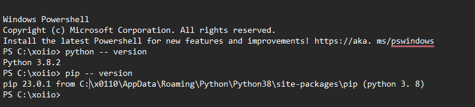
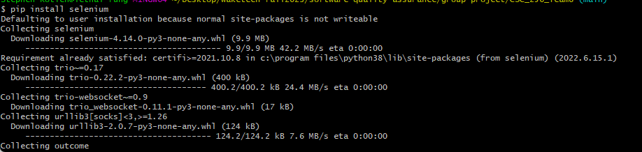
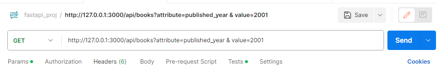
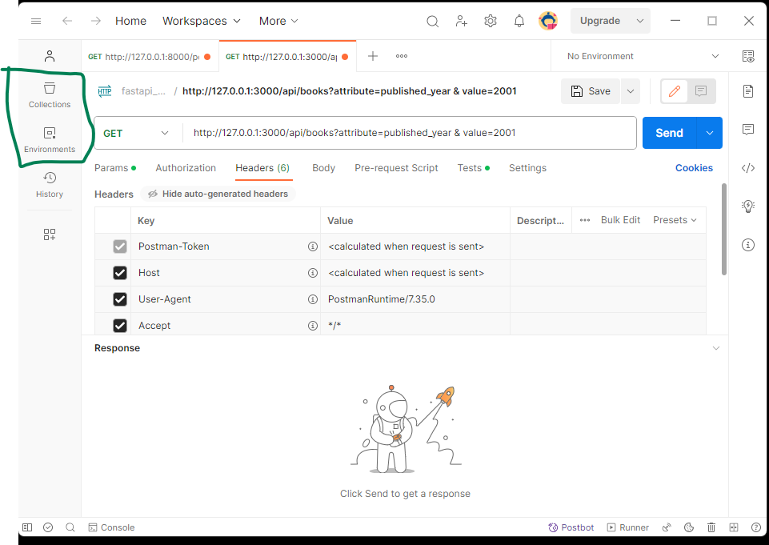
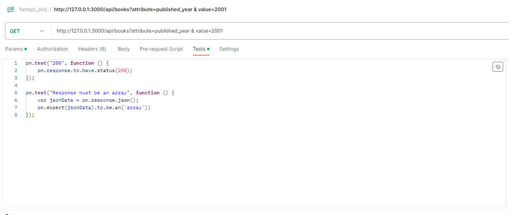

# CSC256 Team 8 Test Labs ReadMe


    
# Table of content 
- [Introduction](#introduction)
  - [objectives](#Objectives)
  - [Project Team](#Project-Team)
  
- [Selenium Lab](#Selenium-Lab)
    - [Introduction](#selenium-intro)
    - [Requirements](#selenium-Requirements)
    - [Setup & installation](#setup-installation)
    - [Lab ](#Lab) 
    
- [BDD Lab](#BDD-Lab)  
    
- [API Test LAB](#API-est-Lab)
    - [Wake County Bookstore API Documentation](#APIDocumentation)
    - [Endpoints](#Endpoints)
    - [Postman Installation and Lab Guide](#postman-lab-Guide)
    - [Lab -Writing and Testing the endpoints ](#APILab) 

- [TDD Lab](#TDD-Lab)

- [Playwrite Lab](#Playwrite-Lab)
    - [ Playwright Lab: Testing a Bookstore Web Application](#Playwrite-intro)
    - [Getting Started with Playwright](#Playwrite-Requirements)
    - [Writing Playwright Tests](#setup-installation)
    - [Conclusion](#Lab) 

# Introduction
 ## objectives
-	Ensure the system meets the functional requirements as detailed in the SRS.
-	Validate the system’s non-functional requirements.
-	Identify and rectify defects prior to release.
-	Ensure the application accurately handles data and operations.
-	Confirm error handling and validation mechanisms.
-	Verify integration between different modules.
-	Ensure usability and efficiency of the command-line interface.

 ## Project Team
    1. Logan Bennett - Code Developer
    2. Samson Truelove - Code Developer
    3. Aiden Morris - Code Developer
    4. Ava Vanduinen - Tester
    5. Sydney Southerland - Tester
    6. Juan Gomez - Tester
    7. Abdul Caesar - Document Writer
    8. Luke Wainwright - Document Writer
    9. Stephen Rotich - Project Lead/document Writer

# 1. Selenium Lab
## Introduction
Selenium is an open-source software suite of browser automation tools for controlling web browsers through programs and performing browser automation. It is functional across browsers and operating systems and can be used in various programming languages.<br>
for more information please visit the selenium lab website <!--[selenium documentation](https://www.selenium.dev/documentation/)--> <a href="https://www.selenium.dev/documentation/">selenium documentation</a>
</p>
<br>
<br>

## Requirements 

  - Installing Python and Selenium WebDriver. 
  - Setting up ChromeDriver for Google Chrome. 
  - Verifying the installation with a simple script 
  
## Setup & installation
please verify that you have python and PIP installed
to verify if python or PIP are  installed ,Open your terminal or command prompt. e.g CMD,powershell,Linux Terminal or Git Bash and type ```python --version```  ```pip --version``` as shown  in the example below using powerShell


If Python or Pip is not installed ,Follow the instructions below

 ```
 Install Python
1. Download Python from the official Python website.
2. Run the installer.
3. Make sure to check the box that says "Add Python to PATH" during installation.
4. Verify Python & PIP are installed
```

python official site: <https://www.python.org/downloads/>
<br>
<br>

#### 2. Selenium installation

Make sure you've completed step 1 and have PIP installed and verified. Then, you'll be ready to easily install Selenium
Using PIP ,install Selenium package  terminal or command prompt by typing `pip install selenium`


<br>
<br>

#### 3. Download WebDriver

Each browser requires a separate driver and needs to be downloadesd separately
for instance :

+ Chrome:<https://sites.google.com/a/chromium.org/chromedriver/>
+ Firefox: <https://github.com/mozilla/geckodriver/releases>
+ Safari: Safari driver come swith the macOS
+ Edge: <https://developer.microsoft.com/en-us/microsoft-edge/tools/webdriver/>
  
__For windows__

```
Extract the downloaded driver and place it in a location of your choice
Add the path to the driver in your system's PATH variable. This ensures Python can access and use the driver.
```

__For Linux__

```
Move the downloaded driver to /usr/local/bin or any directory in your PATH 
Ensure proper permissions are granted to the driver (use chmod +x ) 
```
#### 4. verify the installation by writing and running the following script
```
 # Python script to verify Selenium installation 
from selenium import webdriver

# Specify the path to chromedriver
driver = webdriver.Chrome('http://127.0.0.1:5000')

#  Open a website 
driver.get('http://www.google.com')

# Close the browser
driver.quit()

```
## selenium Lab guide 

This section entails the Implementation of the  tests for different functionalities of a web application, and it covers the creation and running  of tests 

```
from selenium import webdriver
from selenium.webdriver.common.by import By
```

```

# Initialize the Chrome WebDriver. This allows Selenium to control a Chrome browser instance

driver = webdriver.Chrome()

# Navigate to the Flask web application's URL

driver.get("<http://127.0.0.1:5000/>") 
```
```
def test_loading_webpage():
    # Test to ensure the main page loads correctly.
 ```

```
def test_presence_of_elements():
    # Test to verify the presence of key elements on the webpage. 
```

```
def test_search_functionality():
    # Test the search functionality.
    
    # TODO: Add detailed assertions for the search results.
```

```
def test_table_interaction():
    # Test interactions with the book details table.
    
    # TODO: Add detailed assertions for the table interaction results.
    
```

```
test_loading_webpage()
test_presence_of_elements()
test_search_functionality()
test_table_interaction()
driver.close()
```

## selenium Test Cases 
    
# 2. BDD Lab  
    
# 3. API Test LAB 

##   Wake County Bookstore API Documentation

Welcome to the Wake County Bookstore. This API allows developers to access and interact with our online bookstore's features, including browsing books, managing a shopping cart, placing orders, and viewing order history.

## Base URL

The base URL for all API endpoints is: `http://127.0.0.1:3000`

## Authentication

Authentication is required to access specific API endpoints. We use API keys for authentication. To obtain an API key, please get in touch with our support team.

### Request Headers 

 `Authorization: Bearer YOUR_API_KEY  supplied securely via sftp or other encrypted methodologies`  

## Endpoints 
 Get the yaml representation using the openAPI 3.0 specification format here.***[wc-booksore.yaml](./wc-booksore.yaml)***
1. #### List Books

 **Endpoint:** `/api/books` \
 **HTTP Method:** GET \
 **Description:** Get a list of books available in the bookstore. \
 **Parameters:** 
  - `search` : A search query to filter books by title, author, or genre. \
  - `category`: Filter books by category or genre. \
 **Response:** 
    - **Status Code:** 200 OK 
    - **Body:** JSON array containing book objects. Example response: 

```json
  [
    {
        "ISBN": "979-2591-85790-10-5",
        "authors": "Maria Garcia",
        "categories": "History",
        "num_pages": "962",
        "published_year": "2009",
        "subtitle": "The Mysteries",
        "title": "The Wind River"
    },
    {
        "ISBN": "971-4451-85690-10-5",
        "authors": "Charles Osborne;Agatha Christie",
        "categories": "Detective and mystery stories",
        "num_pages": "241",
        "published_year": "2000",
        "subtitle": "A Novel",
        "title": "Spider's Web"
    },
  ]
```

- **Status Code:** 500 OK

2. #### List Books by attribute e.g. published_year

 **Endpoint:** `/api/books?attribute=published_year&value=2007` \
 **HTTP Method:** GET \
 **Description:** Get a list of books available in the bookstore. \
 **Parameters:**

- `search` : A search query to filter books by title, author, or genre. \
- `category`: Filter books by category or genre. \
 **Response:**
  - **Status Code:** 200 OK
  - **Body:** JSON array containing book objects. Example response:

```json
  [
    {
        "ISBN": "979-2591-85790-10-5",
        "authors": "Maria Garcia",
        "categories": "History",
        "num_pages": "962",
        "published_year": "2009",
        "subtitle": "The Mysteries",
        "title": "The Wind River"
    },
    {
        "ISBN": "971-4451-85690-10-5",
        "authors": "Charles Osborne;Agatha Christie",
        "categories": "Detective and mystery stories",
        "num_pages": "241",
        "published_year": "2000",
        "subtitle": "A Novel",
        "title": "Spider's Web"
    },
  ]
```

- **Status Code:** 500 OK

3. #### Display single Book {by unique id e.g. isbn}

 **Endpoint:** `/api/books/{isbn}` \
 **HTTP Method:** GET \
 **Description:** Get detailed information about a specific book. \
 **Parameters:** \
   `book_id` : The unique identifier of the book. \
 **Response:** 
  - **Status Code:** 200 OK 
  - **Body:** JSON array containing book objects. Example response: 

  ```json
  {
  "id": "1",
  "title": "The Great Gatsby",
  "author": "F. Scott Fitzgerald",
  "price": 10.99,
  "description": "A classic novel...",
  "category": "Fiction"
  }
 ```

4. #### Add Book to Cart 

 **Endpoint:** `/api/{{userID}}/cart/add`  \
 **HTTP Method:** POST \
 **Description:** Add a book to the user's shopping cart. \
 **Response:** 
  - **Status Code:** 201 Created 
  - **Body:** Confirmation message. 
  - **Body:** JSON object containing book_id and quantity. 
  
```json
  {
  "book_id": "1",
  "quantity": 2
  }

```

5. #### View Cart 
**Endpoint:** `/api/{{userID}}/cart` \
**HTTP Method:** GET \
**Description:** Get the user's shopping cart contents. \
**Response:** 
  - **Status Code:** 200 OK 
  - **Body:** JSON array of cart items. 

  ```json
    [
        {
          "ISBN": "979-2591-85790-10-5",
          "authors": "Maria Garcia",
          "categories": "History",
          "num_pages": "962",
          "published_year": "2009",
          "subtitle": "The Mysteries",
          "title": "The Wind River"
        }
    ]
  ```

6. #### Remove Book from Cart 
**Endpoint:** /cart/remove/{book_id} \
**HTTP Method:** DELETE \
**Description:** Remove a book from the user's shopping cart. \
**Parameters:** 
`book_id`: The unique identifier of the book. \
**Response:** 
  - **Status Code:** 204 No Content 
  

7. #### Get Categories

**Endpoint:** /categories \
**HTTP Method:** GET \
**Description:** Get a list of available book categories or genres. \
**Response:**

- **Status Code:** 200 OK
- **Body:** JSON array of category objects. Example response:

```json
[
  "Fiction",
  "Non-Fiction",
  "Mystery",
  "Science Fiction"
]
```


## Postman Installation and Lab Guide

Postman is a popular tool for API development and testing. It allows developers and Testers to build, test, and document APIs easily. This guide will help  with the installation process and provide  an overview of how to use Postman to test our wake county onlinebookstore

#### Step 1: Downloading Postman

1. Visit the Postman website to download the application. [Postman Downloads](https://www.postman.com/downloads/).
2. Choose the version suitable for your operating system (Windows, MacOS, Linux).
3. Click on the download link to start the process.

#### Step 2: Installing Postman

- After downloading, open the installer file.
- Follow the on-screen instructions to complete the installation.

## Getting Started with Postman

#### Creating an Account

- Upon opening Postman for the first time, you will be prompted to create an account. This can be done using an email address, Google account, or other sign-in methods.
- Creating an account allows you to sync your collections across devices and access more features.

#### Postman Interface

- Familiarize yourself with the Postman interface. Key areas include:
  - **Request Tab**: Where you create new requests.
  - **Response Section**: View responses to your requests.
  - **Collections**: Organize your requests and tests.

#### Making Your First API Request

1. Click on the `New` button and select `Request`.
2. Enter the details for your request:
   - **URL**: Enter the API endpoint you wish to test.
   - **Method**: Select the HTTP method (GET, POST, PUT, DELETE, etc.).
   - **Headers/Body**: Add as needed depending on your API requirements.
3. Click `Send` to execute the request.
4. The response will appear in the section below.
5. 
   

#### Saving Requests

- Save your requests in collections for easy access and organization.
- Click on the `Save` button after setting up your request and specify the collection to save it in.

#### Using Collections and Environments

- ***grab the collection and Environment files in the github repo inside API test lab folder and import it to your local installed postman***
  
- **Collections**: Group related requests for easier management and execution.

- **Environments**: Use environments to manage sets of variables for different setups (like development, testing, production).
- 
- 

#### Writing  Tests

- Postman allows us to write tests in JavaScript in the `Tests` tab.
- These tests can validate various aspects of the response, such as status codes and response bodies.


#### Running Collections

- Use the Collection Runner to run a series of requests in a collection, which is useful for automated testing.

#### Conclusion

This guide provides  steps to get started with Postman. For more advanced features and detailed documentation, visit the [Postman Learning Center](https://learning.postman.com/).

## Lab setup and testing the endpoints  
    

# 4.  TDD Lab

# 5.  Playwrite Lab
## Playwright Lab: Testing a Bookstore Web Application
Playwright is a powerful framework for automating browsers, allowing developers to simulate user interactions with web applications. It supports multiple browsers, making it ideal for cross-browser testing. Playwright is primarily used for end-to-end testing, which tests the flow of an application from start to finish. It ensures that the integrated components of an application function as expected. This lab will guide you through the process of using Playwright to write and execute tests on a Flask-based bookstore web application.

## Getting Started with Playwright
#### Install Python:
Ensure Python (version 3.7 or higher) is installed on your system. You can download it from .

#### Install Playwright

Open a command line interface and install Playwright using pip:
`pip install` playwright
After installation, run the following command to install the necessary browsers:
`playwright install`

#### Set Up Your Testing Environment:
Create a new folder on your computer for this project.
Download the provided main.py (the Flask web application) and the incomplete playwright_test_suite.py file. Place these in this folder.
Run the Flask Application:
Navigate to your project folder in the command line and run:
`python main.py`
The application should now be running  

#### Learning Resources:
- Official Playwright Documentation:
	- Comprehensive guide and reference to Playwright features and API.
- Online Tutorials and Courses:
	- A course on Udemy covering basics to advanced concepts.
	- A series of video tutorials for visual learners.
- Community Forums and Support:
	- For contributions, issues, and discussions related to Playwright.
	- Community Q&A on Playwright-related topics.


## Writing Playwright Tests
1. Open Your Test File
2. In your project folder, open the file named playwright_test_suite.py.
   This file will contain all your Playwright tests.
#### Basic Playwright Test Structure
A basic Playwright test structure (included) looks like this:
```
from playwright.sync_api import sync_playwright

def run(playwright):
    browser = playwright.chromium.launch(headless=False)
    context = browser.new_context()

    # Define your tests here

    context.close()
    browser.close()

with sync_playwright() as playwright:
    run(playwright)

```


#### Test Examples
1. Test 1 - Loading the Webpage and Checking the Title:
   This test navigates to the main page and checks if the title is as expected.
   ```
	page = context.new_page()
	page.goto("http://127.0.0.1:5000/")
	assert "County Bookstore" in page.title(), "Page title does not match"
   ```
2.  Test 2 - Adding a New Book:
This test simulates adding a new book by interacting with the web elements.
```
	page.click("text=Add Book")  # Click on the 'Add Book' button
	page.fill("input[name='title']", "New Book Title")  # Fill the title
	page.fill("input[name='author']", "Author Name")  # Fill the author
	page.click("text=Submit")  # Submit the new book
	assert "New Book Title" in page.content()  # Verification logic
```

#### Incomplete Test Scenarios (Exercises YOU need to Complete):
3. Test 3 (Incomplete) - Search Functionality:
   Write a test that searches for a book and verifies the search results.
   Instruction: Fill in the search input, click the search button, and assert that the expected result is present in the page content.
4. Test 4 (Incomplete) - Error Handling:
    Write a test for handling an error, like submitting an empty form.
      Instruction: Try submitting the 'Add Book' form without filling in any details and assert that the appropriate error message is displayed.

#### Expected Results from Testing

- Test 1: For the "Loading the Webpage" test, the page title should match "County Bookstore".
- Test 2: In the "Adding a New Book" test, the new book title should be present in the page content after submission.
- Test 3: Expected results will depend on the specific implementation but should generally include successful execution of the search.
- Test 4:  Expected results will depend on the specific implementation but should generally include proper error handling.

#### Running the Tests
Execute your tests using the command:
	` python playwright_test_suite.py `
         Observe the results to ensure all tests are functioning as expected.

## Conclusion
This lab provides a comprehensive introduction to automated web testing using Playwright. Through a mix of guided examples and interactive exercises, you will gain practical experience in testing web applications. This hands-on approach is designed to enhance your skills in both Playwright and general web testing methodologies.
   
   
   
