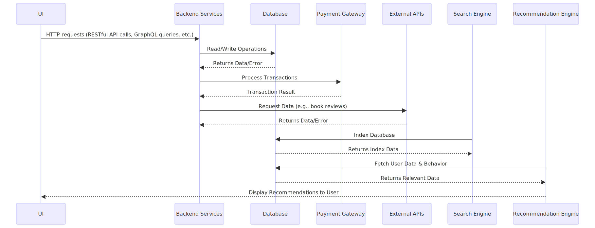

# Wake County Online Bookstore

## High-Level Design (HLD)

#### version 1.0

  

<table>
  <tr>
    <th>Version</th>
    <th>Authors</th>
    <th>Description</th>
    <th>Date Completed</th>
  </tr>
  <tr>
    <td></td>
    <td></td>
    <td></td>
    <td></td>
  </tr>
  <tr>
    <td></td>
    <td></td>
    <td></td>
    <td></td>
  </tr>
  <tr>
    <td></td>
    <td></td>
    <td></td>
    <td></td>
  </tr>
</table>
 
 
 

## System Architecture
 The Online Bookstore will follow a client-server architecture with a three-tier structure:

- **Client Tier/Layer:** The user interacts with the system through a web browser, ensuring a responsive design for various devices.
  1. This represents the Frontend.Interfaces for user registration, book browsing, shopping cart, user account management, and admin panel
  2. web-based UI [HTML5,CSS3,JavaScript]
    
- **Application Tier/Layer:** The core functionalities, such as user authentication, book management, and order processing, will be handled by the server. This tier will include a Python/flask backend
- 1. contains API Endpoints for client-server interaction. 
   
- **Data Tier/Layer:** The data, including user profiles, book details, and order information, will be stored in a relational database 
## Feature Modules 

#### 1. User Management Module
The user management module will have 

-     User Registration
-     User Authentication
-     user Profile Management

#### 2. Book Management Module

-     Book Browsing and Searching
-     Book Details and Reviews 
-     Shopping Cart 
-     Order Processing

#### 4.  Technology Stack
1. Frontend: _HTML5, CSS3, JavaScript_ 
2. Backend: _python -flask_
3. Database:_A relational database system_
4. Version Control: _Git (with platforms like GitHub or GitLab)

#### 5. system interactions and workflows
###### 1. sequence diagram

<!---->

