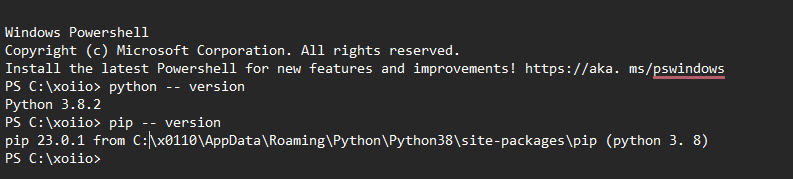

## Selenium Lab : Wake County Online Bookstore

#### Selenium Installation Guide

#### version 1.0

 <br>

<table>
  <tr>
    <th>Version</th>
    <th>Authors</th>
    <th>Description</th>
    <th>Date Completed</th>
  </tr>
  <tr>
    <td></td>
    <td></td>
    <td></td>
    <td></td>
  </tr>
  <tr>
    <td></td>
    <td></td>
    <td></td>
    <td></td>
  </tr>
  <tr>
    <td></td>
    <td></td>
    <td></td>
    <td></td>
  </tr>
</table>
<br>
<br>
<br>

<br>
<p>

###### Brief Introduction
Selenium is an open-source software suite of browser automation tools for controlling web browsers through programs and performing browser automation. It is functional across browsers and operating systems and can be used in various programming languages.<br>
for more information please visit the selenium lab website <!--[selenium documentation](https://www.selenium.dev/documentation/)--> <a href="https://www.selenium.dev/documentation/">selenium documentation</a>

</p>
<br>
<br>

###### 1. Python Installation and setup
please verify that you have python and PIP installed
to verify if python or PIP are  installed ,Open your terminal or command prompt. e.g CMD,powershell,Linux Terminal or Git Bash and type ```python --version```  ```pip --version``` as shown  in the example below using powerShell


If Python or Pip is not installed ,Follow the instructions below
 ```
 Install Python
1. Download Python from the official Python website.
2. Run the installer.
3. Make sure to check the box that says "Add Python to PATH" during installation.
4. Verify Python & PIP are installed
```
python official site: <https://www.python.org/downloads/>
<br>
<br>
###### 2. Selenium installation 
Make sure you've completed step 1 and have PIP installed and verified. Then, you'll be ready to easily install Selenium
Using PIP ,install Selenium package  terminal or command prompt by typing `pip install selenium`


<br>
<br>
###### 3. Download WebDriver
Each browser requires a separate driver and needs to be downloadesd separately
for instance :

+ Chrome:<https://sites.google.com/a/chromium.org/chromedriver/>
+ Firefox: https://github.com/mozilla/geckodriver/releases
+ Safari: Safari driver come swith the macOS 
+ Edge: <https://developer.microsoft.com/en-us/microsoft-edge/tools/webdriver/>
  
__For windows__
```
Extract the downloaded driver and place it in a location of your choice
Add the path to the driver in your system's PATH variable. This ensures Python can access and use the driver.
```

__For Linux__
```
Move the downloaded driver to /usr/local/bin or any directory in your PATH 
Ensure proper permissions are granted to the driver (use chmod +x ) 
```
