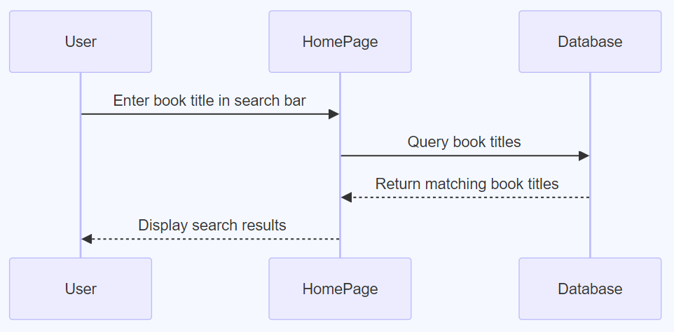
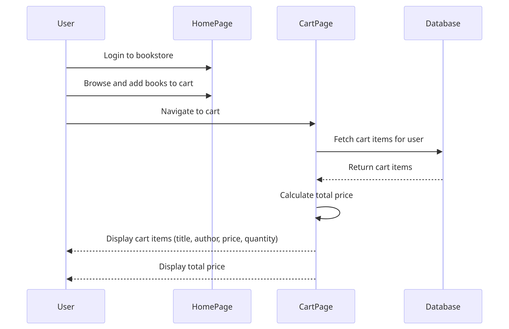

#### TC001 - Book Search Functionality

  This is a database query and no changes should be made in the database
<table>
    <tr>
        <td>Objective</td>
        <td>Validate book search functionality.</td>
    </tr>
    <tr>
        <td>Prerequisite</td>
        <td>User is on the bookstore's homepage and The database has books listed</td>
    </tr>
    <tr>
        <td>Steps</td>
        <td>
            1. Navigate to the search bar. 
            2. Enter a known book title, e.g., "Harry Potter."  
            3. Click <i> Search </i> or press <i>Enter </i>.
        </td>
    </tr>
    <tr>
        <td>Expected Result</td>
        <td>Relevant book titles (all "Harry Potter" series books) display in the results</td>  
    </tr>

</table>

#### TC002 - Add Book to Cart from Search

<table>
    <tr>
        <td>Objective</td>
        <td>Validate the process of adding a book to the cart from search results</td>
    </tr>
    <tr>
        <td>Prerequisite</td>
        <td>User has searched for a book and results are displayed</td>
    </tr>
    <tr>
        <td>Steps</td>
        <td>
            1. From the list of displayed books, locate "Harry Potter and the Philosopher's Stone." 
            2. Click on "Add to Cart."  
        </td>
    </tr>
    <tr>
        <td>Expected Result</td>
        <td>Confirmation pop-up: "Harry Potter and the Philosopher's Stone added to cart. 
        Cart icon updates with a number or indication of content  
        </td>  
    </tr>

</table>

####  TC003 - View Cart Items

<table>
    <tr>
        <td>Objective</td>
        <td>Validate that a user can view all items added to their cart, including the book title, author, price, and quantity. Additionally, validate that the total price is displayed and is the correct sum of all items in the cart</td>
    </tr>
    <tr>
        <td>Prerequisite</td>
        <td>User has added at least one book to the cart.</td>
    </tr>
    <tr>
        <td>Steps</td>
        <td>
            1. log into the online bookstore. 
            2. browse and adds several books to the cart. 
            3.  navigates to the cart page  
        </td>
    </tr>
    <tr>
        <td>Expected Result</td>
        <td>The cart page fetches the cart items from the user's session or database. 
            The page displays all the cart items with book title, author, price, and quantity. 
            The total price for all items in the cart is displayed at the bottom  
        </td>  
    </tr>

</table>

`-----------------> add more test cases `
