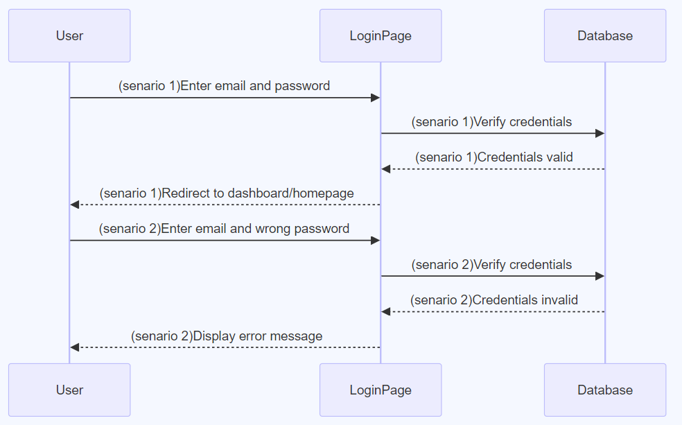

#### TC001 - User Registration Flow

<table>
    <tr>
        <td>Objective</td>
        <td>To validate successful user registration</td>
    </tr>
    <tr>
        <td>Prerequisite</td>
        <td>User is on the registration page, and the provided email isn't already registered.</td>
    </tr>
    <tr>
        <td>Steps</td>
        <td>
            1. Navigate to registration 
            2. Enter details:Name: <i>John Doe </i>,Email: <i>john.doe@example.com</i>,Password: <i>Secure12345</i>, Confirm Password: <i>Secure12345</i>  
            3. Click <i>"Register."</i>
    </tr>
    <tr>
        <td>Expected Result</td>
        <td>
        User is redirected to the homepage or dashboard  
        A welcome message displays: "Welcome back, John Doe!" 
        User-specific elements (like 'My Account', 'My Cart', etc.) are visible and accessible. 
        </td>
    </tr>

</table>

#### TC002 - Registration with Existing Email

No new user entry should created in the database. This is of high importance inorder to maintain data integrity
<table>
    <tr>
        <td>Objective</td>
        <td>To ensure no duplicate registrations with the same email</td>
    </tr>
    <tr>
        <td>Prerequisite</td>
        <td>User is on the registration page.</td>
    </tr>
    <tr>
        <td>Steps</td>
        <td>
            1. Navigate to registration 
            2. Enter details:Name: <i>John Doe </i>,Email: <i>john.doe@example.com</i>,Password: <i>Secure12345</i>, Confirm Password: <i>Secure12345</i>  
            3. Click <i>"Register."</i>
        </td>
    </tr>
    <tr>
        <td>Expected Result</td>
        <td>Error message displays: "Email already registered.</td>   
    </tr>

</table>

#### TC00(3,4) - Successful User Login & Unsuccessful User Login with Incorrect Password

user login is of  _Critical importance_.it is fundamental for users to access their personal account and perform transactions.

  __TC00(3) -  Successful User Login__
<table>
<tr>
    <td>Objective</td>
    <td>To validate that a registered user can successfully log in using valid credentials</td>
</tr>
<tr>
    <td>Prerequisite</td>
    <td>User is on the login page, and they have already registered with the email john.doe@example.com and password Secure12345</td>
</tr>
<tr>
    <td>Steps</td>
    <td>
        1. Navigate to the login page if not already there. 
        2. Enter Email: <john.doe@example.com>. 
        3. Enter Password: Secure12345. 
        4. Click the "Login" button. 
</tr>
<tr>
    <td>Expected Result</td>
    <td>
       User is redirected to the homepage or dashboard  
       A welcome message displays: "Welcome back, John Doe!" 
       User-specific elements (like 'My Account', 'My Cart', etc.) are visible and accessible. 
    </td>
</tr>
</table>

__TC00(4) - UnSuccessful User Login__
   
<table>
    <tr>
        <td>Objective</td>
        <td>validate the system's behavior when a registered user attempts to log in using an incorrect password</td>
    </tr>
    <tr>
        <td>Prerequisite</td>
        <td>User is on the login page, and they have already registered with the email john.doe@example.com and password Secure12345</td>
    </tr>
    <tr>
        <td>Steps</td>
        <td>1. Navigate to the login page if not already there. 
            1. Enter Email: john.doe@example.com.  
            2. Enter Password: WrongPassword456. 
            3. Click the "Login" button.</td>
    </tr>
    <tr>
        <td>Expected Result</td>
        <td>User remains on the login page. 
            An error message displays: "Incorrect password. Please try again." 
            The password field is either cleared or highlighted for re-entry.  
        </td>
    </tr>

</table>

#### TC005 - Book Search Functionality

  This is a database query and no changes should be made in the database
<table>
    <tr>
        <td>Objective</td>
        <td>Validate book search functionality.</td>
    </tr>
    <tr>
        <td>Prerequisite</td>
        <td>User is on the bookstore's homepage and The database has books listed</td>
    </tr>
    <tr>
        <td>Steps</td>
        <td>
            1. Navigate to the search bar. 
            2. Enter a known book title, e.g., "Harry Potter."  
            3. Click <i> Search </i> or press <i>Enter </i>.
        </td>
    </tr>
    <tr>
        <td>Expected Result</td>
        <td>Relevant book titles (all "Harry Potter" series books) display in the results</td>  
    </tr>

</table>

#### TC006 - Add Book to Cart from Search

<table>
    <tr>
        <td>Objective</td>
        <td>Validate the process of adding a book to the cart from search results</td>
    </tr>
    <tr>
        <td>Prerequisite</td>
        <td>User has searched for a book and results are displayed</td>
    </tr>
    <tr>
        <td>Steps</td>
        <td>
            1. From the list of displayed books, locate "Harry Potter and the Philosopher's Stone." 
            2. Click on "Add to Cart."  
        </td>
    </tr>
    <tr>
        <td>Expected Result</td>
        <td>Confirmation pop-up: "Harry Potter and the Philosopher's Stone added to cart. 
        Cart icon updates with a number or indication of content  
        </td>  
    </tr>

</table>

####  TC007 - View Cart Items

<table>
    <tr>
        <td>Objective</td>
        <td>Validate that a user can view all items added to their cart, including the book title, author, price, and quantity. Additionally, validate that the total price is displayed and is the correct sum of all items in the cart</td>
    </tr>
    <tr>
        <td>Prerequisite</td>
        <td>User has added at least one book to the cart.</td>
    </tr>
    <tr>
        <td>Steps</td>
        <td>
            1. log into the online bookstore. 
            2. browse and adds several books to the cart. 
            3.  navigates to the cart page  
        </td>
    </tr>
    <tr>
        <td>Expected Result</td>
        <td>The cart page fetches the cart items from the user's session or database. 
            The page displays all the cart items with book title, author, price, and quantity. 
            The total price for all items in the cart is displayed at the bottom  
        </td>  
    </tr>

</table>

`-----------------> add more test cases `